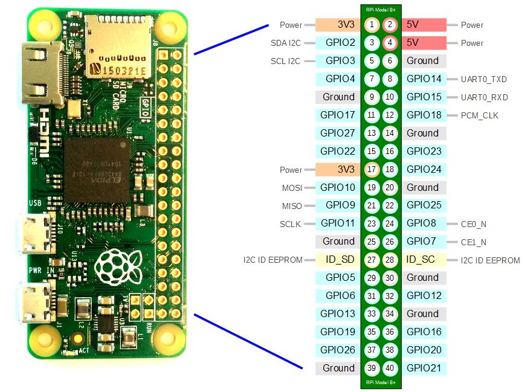

# Pinbelegung ICS43434 Mikrofon für Raspberry Pi Zero W

## Übersicht
Das ICS43434 ist ein digitaler I2S-Mikrofon, der über die I2S-Schnittstelle mit dem Raspberry Pi Zero W verbunden wird.

## Pin-Verbindungen

| ICS43434 Pin | Raspberry Pi Zero W Pin | Funktion |
|--------------|------------------------|----------|
| Sel          | GPIO 20 (Pin 38)       | Channel Select (L/R) |
| Lrcl         | GPIO 21 (Pin 40)       | Left/Right Clock (WS) |
| BCLK         | GPIO 18 (Pin 12)       | Bit Clock (SCK) |
| Dout         | GPIO 19 (Pin 35)       | Serial Data (SD) |
| GND          | GND (Pin 6, 9, 14, 20, 25, 30, 34, 39) | Ground |
| 3V           | 3.3V (Pin 1, 17)      | Stromversorgung |

## Raspberry Pi Zero W GPIO Pinout

```
     3V3  (1) (2)  5V
   GPIO2  (3) (4)  5V
   GPIO3  (5) (6)  GND
   GPIO4  (7) (8)  GPIO14
     GND  (9) (10) GPIO15
  GPIO17 (11) (12) GPIO18  ← BCLK
  GPIO27 (13) (14) GND
  GPIO22 (15) (16) GPIO23
     3V3 (17) (18) GPIO24
  GPIO10 (19) (20) GND
   GPIO9 (21) (22) GPIO25
  GPIO11 (23) (24) GPIO8
     GND (25) (26) GPIO7
   GPIO0 (27) (28) GPIO1
   GPIO5 (29) (30) GND
   GPIO6 (31) (32) GPIO12
  GPIO13 (33) (34) GND
  GPIO19 (35) (36) GPIO16  ← DIN
  GPIO26 (37) (38) GPIO20
  GPIO20 (37) (38) GPIO20  ← Sel
     GND (39) (40) GPIO21  ← Lrcl
```




## Anschlussbeispiel

```
ICS43434     →    Raspberry Pi Zero W
----------         ------------------
Sel         →    Pin 38 (GPIO20)
Lrcl        →    Pin 40 (GPIO21)
BCLK        →    Pin 12 (GPIO18)  
Dout        →    Pin 35 (GPIO19)
GND         →    Pin 6  (GND)
3V          →    Pin 1  (3.3V)
```

## Wichtige Hinweise

- Das ICS43434 arbeitet mit 3.3V Spannung
- Verwende kurze Kabelverbindungen zur Minimierung von Störungen
- Stelle sicher, dass die I2S-Schnittstelle auf dem Raspberry Pi aktiviert ist
- Das Mikrofon unterstützt 16-24 Bit Auflösung bei 8-96 kHz Abtastrate

## I2S-Aktivierung auf Raspberry Pi

Füge folgende Zeilen zur `/boot/config.txt` hinzu:
```
dtparam=i2s=on
dtoverlay=i2s-mmap
```

Starte danach den Raspberry Pi neu.
