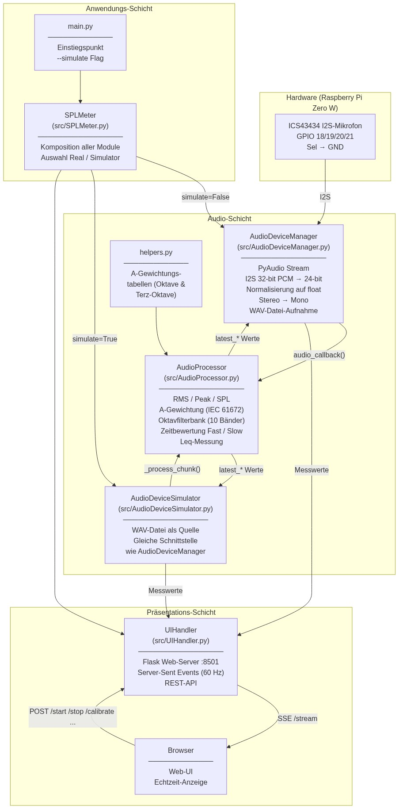
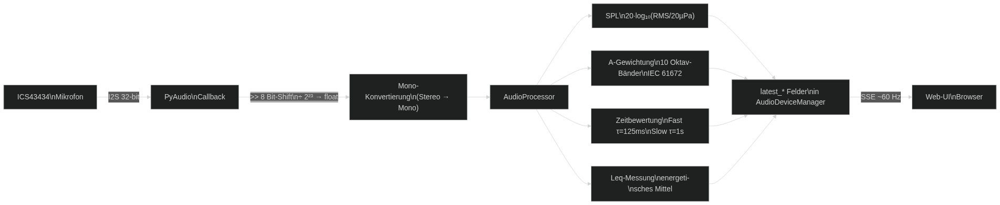
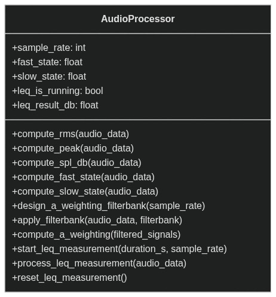
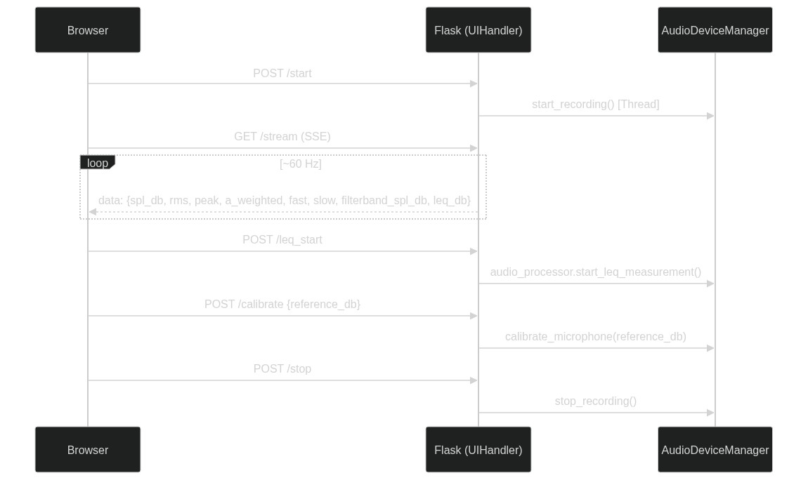

# SPL Meter Architecture

## Projektübersicht

Dieses Projekt implementiert ein Sound Pressure Level (SPL) Meter auf einem Raspberry Pi Zero W mit einem ICS43434 I2S-Mikrofon. Die Messwerte werden über ein Flask-basiertes Web-Interface in Echtzeit angezeigt. Zusätzlich existiert ein Simulator-Modus, der eine WAV-Datei als Audioquelle verwendet — nützlich für Entwicklung und Tests ohne physische Hardware.

## Systemarchitektur

Das System ist in drei Schichten aufgeteilt: Hardware, Audioverarbeitung und Präsentation.

## Datenfluss

## Modul-Beschreibungen

### `main.py` — Einstiegspunkt

Startet das Programm. Wertet `--simulate <pfad.wav>` aus und übergibt die Konfiguration an `SPLMeter`.

### `SPLMeter` — Kompositions-Root

Erstellt `AudioProcessor`, wählt zwischen `AudioDeviceManager` (echtes Mikrofon) und `AudioDeviceSimulator` (WAV-Datei), und startet `UIHandler`.

### `AudioDeviceManager` — Hardware-Treiber

| Aufgabe | Details |
|---|---|
| Stream-Verwaltung | PyAudio öffnet I2S-Gerät, Callback-Architektur |
| Bit-Konvertierung | 32-bit PCM → 24-bit MSB-shift → float [-1, 1] |
| Kanal-Handling | Stereo → Mono-Mittelung vor Verarbeitung |
| Kalibrierung | `calibrate_microphone(ref_db)` berechnet `calibration_offset_db` |
| WAV-Aufnahme | Float-Blöcke akkumulieren, auf Wunsch als `.wav` speichern |
| Speicher-Management | Älteste Aufnahmen löschen ab 1,6 GB Gesamtgröße |

### `AudioDeviceSimulator` — Test-Ersatz

Implementiert dieselbe Schnittstelle wie `AudioDeviceManager` (gleiche `latest_*`-Felder, `start_recording()`, `stop_recording()`). Liest eine WAV-Datei und verarbeitet sie Chunk für Chunk in Echtzeit.

### `AudioProcessor` — Signalverarbeitung

**A-Gewichtungs-Filterbank:** 10 Butterworth-Bandpassfilter (Ordnung 10) nach IEC 61672:2014, Mittenfrequenzen 8 Hz – 16 kHz (Oktavabstand). A-Gewichtungsfaktoren aus `helpers.py`.

**Leq-Messung:** Energetisches Mittel über eine konfigurierbare Dauer (5 s – 300 s). Formel: `Leq = 10·log₁₀(Σp²/N / p₀²)`.

**Zeitbewertung:** Vektorisierter exponentieller gleitender Mittelwert über Quadratdruck. Fast: τ = 125 ms, Slow: τ = 1 s.

### `UIHandler` — Web-Interface

**REST-Endpunkte:**

| Methode | Pfad | Funktion |
|---|---|---|
| GET | `/` | Web-UI HTML |
| POST | `/start` | Messung starten |
| POST | `/stop` | Messung stoppen |
| GET | `/stream` | SSE Echtzeit-Datenstrom |
| POST | `/leq_start` | Leq-Messung starten |
| POST | `/leq_duration` | Leq-Dauer wählen (Index 0–5) |
| POST | `/calibrate` | Mikrofon kalibrieren |
| POST | `/store_recording` | WAV-Aufnahme aktivieren |
| POST | `/set_third_octave_bands` | Terz-Filterbänder aktivieren |
| POST | `/num_bands` | Anzahl Filterbänder setzen (4/6/8/10/12/36) |

## Technische Spezifikationen

### Audio-Parameter
- **Abtastrate:** 48 kHz
- **Bit-Tiefe:** 32-bit PCM (I2S-Treiber), 24-bit effektive Daten (8-bit MSB-Shift)
- **Kanäle:** Stereo-Eingang, Mono-Verarbeitung
- **Chunk-Größe:** 1024 Samples (~21 ms bei 48 kHz)

### SPL-Berechnung
- **Referenzdruck:** p₀ = 20 µPa
- **Formel:** SPL [dB] = 20 · log₁₀(RMS / p₀)
- **Kalibrierung:** additiver Offset in dB, per Referenzschallquelle ermittelt

### Leq-Dauern (auswählbar)
5 s · 10 s · 15 s · 30 s · 60 s · 300 s

## Abhängigkeiten

### System-Anforderungen
- Raspberry Pi Zero W
- ICS43434 I2S-Mikrofon
- `dtoverlay=googlevoicehat-soundcard` in `/boot/firmware/config.txt`

### Python-Pakete
- `numpy` — numerische Berechnungen
- `pyaudio` — Audio-I/O (PortAudio-Wrapper)
- `scipy` — Butterworth-Filterdesign (`signal.butter`, `signal.sosfilt`)
- `flask` — Web-Server / REST-API

### System-Pakete (via apt)
- `libopenblas-dev` — numpy-Laufzeitbibliothek
- `portaudio19-dev` — pyaudio-Laufzeitbibliothek
- `python3-pip`, `python3-venv`
- `raspi-gpio` — GPIO-Diagnosetool

## Erweiterungsmöglichkeiten

### Mögliche zukünftige Features
- Frequenzanalyse (FFT / Spektrogramm)
- Terz-Oktav-Filterbank (bereits in `helpers.py` vorbereitet)
- Persistentes Daten-Logging (CSV / SQLite)
- Schwellenwert-Alarme
- Mobile-optimierte UI
